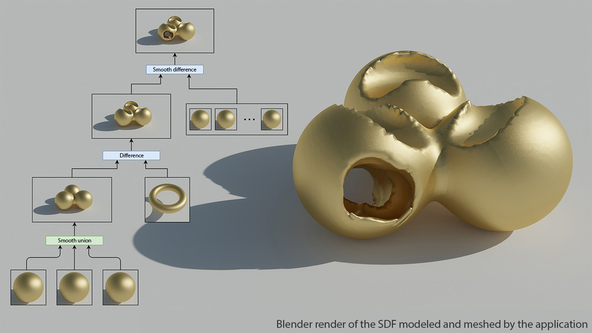
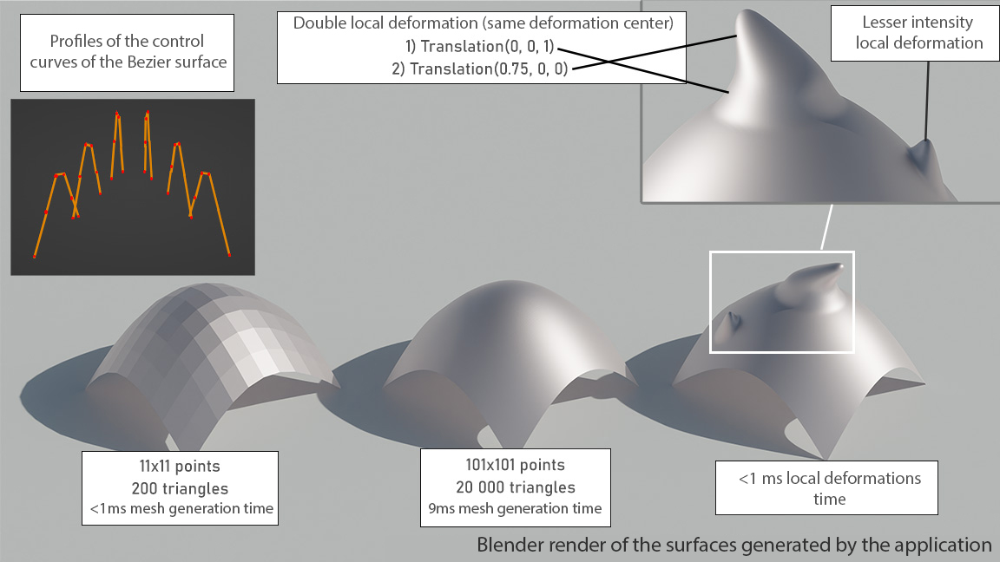

This project implements the representation of implicit surfaces using SDFs  and their meshing using a marching cube algorithm. Some boolean operators are also defined on the SDFs (union, smooth union, intersection, difference, ...).
Signed distance functions are very powerful tools (cf. [Inigo Quilez' Shadertoy profile](https://www.shadertoy.com/user/iq)).
This project also implements revolution surfaces, generation of a mesh from a Bezier surface description and mesh local deformations.

Implemented features:
- Signed distance functions
- Boolean operators on SDFs (union, smooth union, intersection, difference, ...)
- Ray marching algorithm for meshing an SDF

- Meshing of a Bezier surface with arbitrary precision
- Local deformation of a mesh

- Revolution surfaces using a Bezier curve as the revolution profile
- Mesh twisting operator

